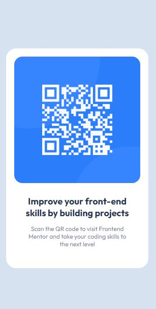

# Frontend Mentor -CHALLENGE-1-QR-Component- 💥✨🐱‍🏍

QR code component coding challenge

This is a solution to the First Challenge [QR code component challenge on Frontend Mentor](https://www.frontendmentor.io/challenges/qr-code-component-iux_sIO_H).
Frontend Mentor challenges help you improve your coding skills by building realistic projects.

### Screenshot

Screensot Mobile

Screensot Desktop

### Links

You can find the challenge in the first link, as well as my solution below.

- Challenge URL: [(https://www.frontendmentor.io/challenges/qr-code-component-iux_sIO_H)]
- My solution live Site URL: [(https://celiarodriguezmo.github.io/Reto-1-qr-component/)]

## My process

- 1º Make a sketch of the Qr Component.
- 2º Write the HTML syntax with correct semantic tags.
- 3º Add CSS styles starting with Mobile-first looking at the designs of the challenge.
- 4º Upload the page to GitHub Pages.
- 5º Make a complete Readme!

### Built with

- Semantic HTML5 markup
- CSS custom properties
- Flexbox
- Mobile-first workflow

### Continued development

First frontend mentor challenge done, the first of many I want to do to perfect my frontend skills.

## Author

- Website - [My GitHub profile](https://github.com/celiarodriguezmo)
- Frontend Mentor - [@celiarodriguezmo](https://www.frontendmentor.io/profile/celiarodriguezmo)

## Feedback

Constructive comments are welcome from anyone to help me improve my code.

Send me an email at the following adress celiro02@gmail.com

Thanks!☮
